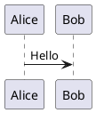

# 题库 JSON 统一格式

题库根节点必须是数组。推荐单题框架：

```json
{
  "id": "q-001",
  "number": 1,
  "type": "single",
  "content": "题干，支持纯文本或 Markdown",
  "format": "markdown",
  "options": { "A": "选项 A", "B": "选项 B" },
  "answer": "A",
  "explanation": "答案解析",
  "wrongDescription": "错因、易错点或复习提示"
}
```

完整示例见 `examples/question-bank.example.json`。机器可读约束见 `schemas/question-bank.schema.json`，LLM 转换结果应先通过该 Schema，再交给应用加载器规范化。

## 题型 type

- `single`：单选题
- `multiple`：多选题
- `true-false`：判断题
- `fill`：填空题
- `short-answer`：简答题
- `program-analysis`：程序分析题
- `code`：编程题
- `compound`：复合题

旧题库中的中文题型和 `SQL综合题` 仍兼容；新题库应使用以上稳定标识。

## 字段约定

- `id` 可选；`number` 可省略，省略时按数组顺序生成。
- `content` 是统一题干字段；旧字段 `question` 仍兼容。
- `format` 指定题干格式，支持 `text`、`txt`、`markdown`、`mermaid`、`plantuml`；`txt` 与 `text` 等价。旧题库可以省略，默认 `text`；AI 新生成的题目和子题会显式输出该字段。
- `answerFormat`、`scenarioFormat`、`explanationFormat` 可独立覆盖对应内容格式，使用同样的取值。未指定时继承普通题干的格式；题干为 `mermaid` 或 `plantuml` 时，其他字段、选项和子题默认 `text`，避免把普通答案当作图表。
- 子题可以独立设置 `format`、`answerFormat`；显式设置子题 `format` 后，未指定的答案格式跟随该子题（图表格式仍默认 `text`）。未指定子题格式时保留外层普通格式和答案格式的继承行为。
- 加载器和 AI 转换兼容 `md`、`mmd`、`puml` 等常见别名，并统一为 `markdown`、`mermaid`、`plantuml`；手写且需要通过 JSON Schema 校验的题库应使用上述标准值。
- `options` 是选项键值对象；多选答案可写成 `["A", "C"]` 或 `"AC"`。
- `answerDetail.accepts` 可列出多个可接受答案。
- `wrongDescription` 可填写错因、易错点或复习提示，仅在错题模式中重点展示；导出错题 JSON 时会保留。
- `images` contains image URL arrays. During DOCX conversion, embedded images are extracted into `images/<bank>/`; the prompt uses `<source_image id="..."/>` and the manifest to associate them with questions. Filenames are opaque numeric identifiers such as `img-001.png`; do not infer meaning from them or use local absolute paths/data URLs.
- 题干、场景、子题、答案或解析中出现的程序代码必须使用 Markdown fenced code block（例如 ` ```python `），并将对应格式设置为 `markdown`。
- `compound` 使用 `scenario` 与 `subQuestions`；子题同样优先使用 `content`。
- 同一题库的 `number` 不可重复，未知题型或结构错误会在加载时被拒绝。

## 纯图表格式

只有图表源码时，可直接声明格式，不需要 Markdown 围栏：

```json
{
  "id": "diagram-001",
  "number": 1,
  "type": "short-answer",
  "content": "flowchart LR\n  A[开始] --> B[完成]",
  "format": "mermaid",
  "answer": "流程从开始到完成。",
  "answerFormat": "text"
}
```

`plantuml` 同样直接保存包含 `@startuml` / `@enduml` 的源码。图表和说明文字混合时应使用 `markdown` 并加图表围栏；不要将整段说明当作图表源码。AI 转换、修复和独立答案匹配会保留并独立标注各字段格式，不会因 Markdown 答案覆盖图表题干格式。

## Markdown 图表

Mermaid：

````markdown

````

PlantUML（也接受 `puml`）：

````markdown

````

Mermaid 在浏览器本地渲染。PlantUML 默认把图表源码发送到 `diagram-renderer.json` 指定的远程服务器并返回 SVG；敏感内容应改用可信的自建 PlantUML Server，或将 `plantUml.enabled` 设置为 `false`。
